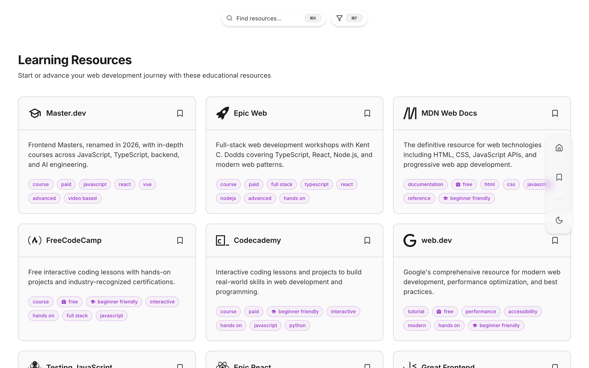

# Web Development Hub

[](https://github.com/jayvicsanantonio/web-development-hub/actions/workflows/ci.yml)

A curated directory of web development links - documentation, courses, tools,
frameworks, communities, blogs and newsletters - live at
**[webdevhub.link](https://webdevhub.link)**. It is a Next.js 15 static export
served by Cloudflare Workers, with no server runtime and no database.

<picture>
  <source media="(prefers-color-scheme: dark)" srcset="docs/images/section-dark.png">
  
</picture>

## Using the Site

The resources are grouped into five sections:
[Learning Resources](https://webdevhub.link/learning-resources),
[Developer Tools](https://webdevhub.link/developer-tools),
[Frameworks and Libraries](https://webdevhub.link/frameworks-and-libraries),
[Communities](https://webdevhub.link/communities) and
[Blogs and Newsletters](https://webdevhub.link/blogs).

- **Search** every resource from the home page, or just the section or the
  bookmarks being viewed
- **Filter** by tag, such as `free`, `beginner-friendly` or `react`
- **Bookmark** resources to keep them on the bookmarks page
- **Switch** between light and dark themes

Bookmarks and the theme are kept in the visitor's own browser; there are no
accounts.

Keyboard shortcuts (`Cmd` on macOS, `Ctrl` elsewhere):

| Shortcut | Action |
| --- | --- |
| `Cmd+K` | Focus search (`/` or `F` too, when not typing in a field) |
| `Cmd+F` | Open or close the tag filter, in place of the browser's find |
| `Cmd+B` | Go to bookmarks |
| `Cmd+H` | Go home |
| `Cmd+Shift+L` | Switch between light and dark |
| `Esc` | Clear the search |

## Suggesting a Resource

Know a resource that belongs here?
[Open an issue](https://github.com/jayvicsanantonio/web-development-hub/issues/new)
with the link, the section it belongs in and a line on why it is worth adding,
or add it yourself as described under [Adding a Resource](#adding-a-resource).

## Getting Started

### Prerequisites

- Node.js 22, pinned in `.node-version`. The setup below selects it with
  [fnm](https://github.com/Schniz/fnm): `brew install fnm` (or visit
  https://github.com/Schniz/fnm#installation for other methods)
- [pnpm](https://pnpm.io/) 11, the major CI pins: `brew install pnpm` (or visit
  https://pnpm.io/installation for other methods)

### Setup

1. Select the Node.js version, installing it if it is missing:

   ```bash
   fnm use --install-if-missing
   ```

2. Install dependencies:

   ```bash
   pnpm install
   ```

3. Run the development server:

   ```bash
   pnpm dev
   ```

Open [http://localhost:3000](http://localhost:3000) with your browser to see the result.

### Project Layout

| Path | What it holds |
| --- | --- |
| `constants/sections.ts` | Every section and resource: all the data the site has |
| `app/` | The routes: home, a page per section, bookmarks and the legal pages |
| `components/` | What the routes render; `components/ui/` holds the cards, search, filter panel and navigation |
| `contexts/` | The bookmarks and search state |
| `hooks/` | The keyboard shortcuts |
| `lib/` | Shared types, the bookmarks store, the theme, icons and utilities |
| `scripts/` | The icon bundle builder and the link checker |
| `e2e/` | The Playwright smoke tests |
| `public/_headers` | Security and caching headers |

Before changing anything, read [AGENTS.md](AGENTS.md): it holds the commands,
the architecture and the conventions - permanent resource ids, retired hrefs,
bundled icons - for people and coding agents alike. [docs/](docs/README.md)
holds a modern CSS reference and the archived design documents.

## Adding a Resource

Every section and resource lives in `constants/sections.ts`, so adding one is a
data-only change. An entry looks like this:

```ts
{
  id: 'mdn-web-docs',
  title: 'MDN Web Docs',
  href: 'https://developer.mozilla.org/',
  icon: 'simple-icons:mdnwebdocs',
  description:
    'The definitive resource for web technologies including HTML, CSS, JavaScript APIs, and progressive web app development.',
  tags: ['documentation', 'free', 'html', 'css', 'javascript'],
},
```

- `id` is permanent: bookmarks are stored by it, so take it from the title and
  never change or reuse it. When an existing resource's `href` changes, add the
  old one to `constants/retired-hrefs.ts`.
- `icon` names an icon in an installed Iconify set (the `@iconify-json/*`
  packages in `package.json`); browse them at
  [icon-sets.iconify.design](https://icon-sets.iconify.design). A name no
  installed set has fails the build.
- `tags` are lowercase words joined by hyphens. Reuse existing ones where they
  fit: every distinct tag becomes an option in the filter panel.
- `pnpm test` fails on a duplicate id, href or title, and
  `pnpm check:links --section "<section title>"` checks that the link works.

## Checks

Run these before opening a pull request:

```bash
pnpm lint
pnpm typecheck
pnpm test
```

`pnpm build:checked` runs all three, then builds.

`pnpm test:e2e` runs the Playwright suite against the static export, served
through wrangler the way production serves it. It builds the export and starts
wrangler on port 8788 itself, except outside CI when a server is already
listening there: that one is tested as it is, without a rebuild. Install its
browser once with `pnpm exec playwright install chromium`.

Every resource is an external link, so links break without anything in this
repository changing. `pnpm check:links` checks them all, and
`.github/workflows/check-links.yml` runs it every Monday, opening or commenting
on a `link-rot` issue when a link is genuinely broken.

## Deployment

The site is a static export (`next build` with `output: 'export'`) served by
Cloudflare Workers from `out/`. There is no server runtime: `wrangler.jsonc`
declares no `main`, only static assets.

Cloudflare **Workers Builds** is connected to this repository and does the
deploying:

| Environment | Trigger | URL |
| --- | --- | --- |
| Preview | Any branch / pull request | `<branch>-web-development-hub.hi-00e.workers.dev` |
| Production | Push to `main` | [webdevhub.link](https://webdevhub.link) |

A preview publishes a Worker *version*, not a deployment, so it cannot shift
production traffic. Preview URLs are commented on each pull request.

`.github/workflows/ci.yml` does not deploy, and Workers Builds does not wait
for it. Two settings outside the code decide whether a broken commit can reach
production: the Workers Builds build command, which should be
`pnpm build:checked`, and a ruleset on `main` requiring CI's `build` check.
[AGENTS.md](AGENTS.md#deployment) describes both.

To deploy by hand: `pnpm preview` serves the built export locally through
wrangler, `pnpm upload` uploads a version without shifting traffic, and
`pnpm deploy` deploys to production.
